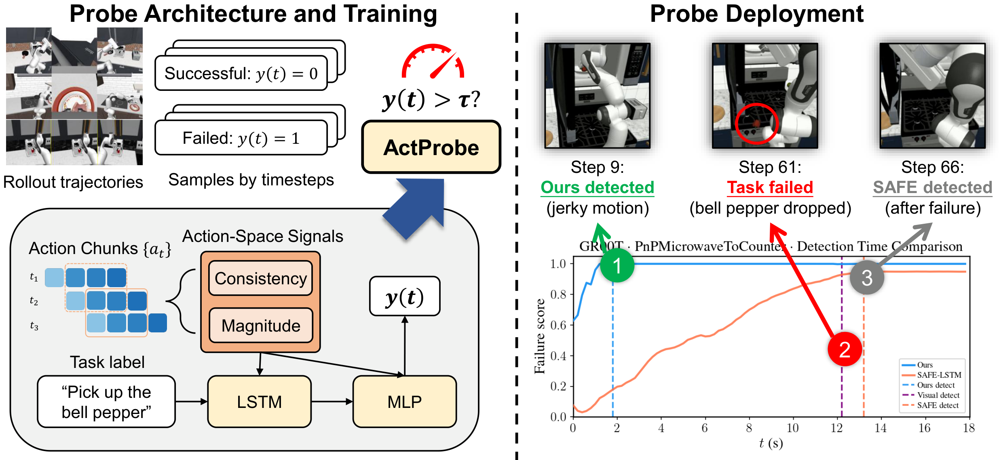

# ActProbe: Action-Space Probe for Early Failure Detection of Generative Robot Policies

[Project Page](https://air-embodied-brain.github.io/actprobe/) &middot; [Paper (arXiv)](https://arxiv.org/abs/2606.08508) &middot; Preprint

<p align="center">
  
</p>

<p align="center"><em>ActProbe raises an alarm before failures become visually recognizable by probing action-space signals at runtime; the strongest hidden-state baseline only fires once the failure has already happened.</em></p>

**ActProbe** is a lightweight, *pure action-space* detector that anticipates failures of generative
robot policies (VLAs and world-action models) before they become visually recognizable. It reads two
compact signals directly from the emitted action chunks — **Temporal Consistency Error (TCE)** between
consecutive chunks and **Action Chunk Magnitude (ACM)** of the current chunk — and maps them to
per-step failure probabilities with a small (~24K-parameter) task-conditioned LSTM–MLP. No white-box
access, no resampling, no observation-side fusion.

This repository contains the benchmark code, the training data, and the scripts to train and evaluate
ActProbe across five policy–environment settings.

## Installation

```bash
git clone https://github.com/air-embodied-brain/actprobe.git
cd actprobe
pip install -r requirements.txt   # torch>=2.7, numpy, scipy, scikit-learn, transformers (Qwen3-Embedding), ...
```

Scripts are meant to be run from the repository root (or from a benchmark directory after sourcing its
`env.sh`).

## Data

This release is self-contained for **ActProbe**. Each benchmark under `benchmarks/<name>/` ships the
per-step action-space features used to train and evaluate the probe plus the task embeddings used for
task conditioning. We do **not** ship trained probe weights — the probe is tiny (~24K params) and
trains in about a minute per seed from this data (see *Train and evaluate* below).

| Benchmark | Shipped ActProbe data | Task-conditioning data |
|---|---|---|
| `pi0_libero` | `data/metrics_logs/task_{0..9}.jsonl` | `data/task_embeddings.npy`, `data/task_instructions.json` |
| `openvla_libero` | `data/metrics_logs/task_{0..9}.jsonl` | `data/task_embeddings.npy`, `data/task_instructions.json` |
| `groot_robocasa` | `data/metrics_logs/*.jsonl` | `data/task_embeddings.npy`, `data/task_instructions.json` |
| `pi05_robocasa` | `data/probe_data/*.pkl` | `data/qwen3_emb.pkl` |
| `pi05_robocasa_multistage` | `data/probe_data/*.pkl` | `data/qwen3_emb.pkl` |

For exact field schemas and feature ordering, use each benchmark's loader as the source of truth:
`benchmarks/<name>/code/lib/data.py`.

The baseline detectors (SAFE, LogpZO, …) additionally consume large hidden-state features, which are
**not** included here; only the ActProbe results can be reproduced from the shipped data alone.

## Train and evaluate ActProbe

Each benchmark under `benchmarks/<name>/` is self-contained. Source its `env.sh` (which auto-derives
paths and the Python interpreter), then train and/or evaluate:

```bash
cd benchmarks/groot_robocasa
source env.sh

# 1. Train the probe — no weights are shipped, so train first.
#    train_all.sh trains 3 probes on 3 random seeds (each seed = a fresh random
#    train/val/test split); use N_SEEDS=5 for more. Checkpoints land in
#    checkpoints/actprobe/.
bash scripts/train_all.sh
#    (or call the trainer directly for a fixed set:
#     python code/train/train_actprobe.py --splits allseen unseen --seeds 0 1 2)

# 2. Evaluate (writes a metrics JSON). Seeds are auto-detected from whatever
#    checkpoints you trained in step 1.
python code/eval/eval_main_table.py --methods actprobe --out /tmp/groot_main_table.json
```

Dropping `--methods actprobe` also scores the baseline detectors, which need the hidden-state features
noted above; ActProbe itself runs from the shipped data alone.

## Reproducing the feature data (optional)

You do **not** need this to train or evaluate ActProbe — the shipped `data/` already contains the
per-step features. We include the collection code under `benchmarks/<name>/scripts/collect/` so the
features can be regenerated from raw policy rollouts. (ActProbe itself uses only two of them — **TCE**
(`chunk_mse`) and **ACM** (`action_norm`); the rest are kept for completeness and ablations.)

Collection takes one of two forms, depending on the policy:

- **Post-hoc extraction** — offline, on saved rollout records, no VLA required:
  - `pi0_libero/scripts/collect/extract_features.py` — reads π0 `env_records/` + `policy_records/`.
  - `openvla_libero/scripts/collect/extract_features.py` — reads OpenVLA per-episode CSV + PKL.
- **Online logging during rollout** (reference) — features are logged as the policy runs, because the
  denoising / ODE-trajectory curvature is produced by the policy itself. These need the corresponding
  VLA stack (GR00T + robosuite, or an openpi π0.5 server):
  - `groot_robocasa/scripts/collect/rollout_log_metrics.py`
  - `pi05_robocasa/scripts/collect/eval_log_metrics.py` — the multi-stage benchmark reuses this by
    passing a multi-stage task list via `--tasks`.

The split is a matter of provenance. The LIBERO rollout records consumed by the post-hoc extractors are
produced by the SAFE / [vla-safe](https://github.com/vla-safe/SAFE) rollout pipelines, which dump
per-step `env_records`/`policy_records` (and CSV logs) to disk — so we extract features from those dumps
offline. The RoboCasa benchmarks have no such pre-dumped archive: the policies are rolled out directly
and the (compact) features are logged online during the run.

Either way, each episode is one JSON line:
`{episode_id, success, length, steps: [{t, chunk_mse, action_norm, ...}, ...]}`.

## RL fine-tuning

ActProbe also accelerates online RL fine-tuning by early-terminating rollouts it predicts will fail.
The PPO integration for LIBERO (built on [RLinf](https://github.com/RLinf/RLinf)) lives in a separate
fork:

> **RL code:** https://github.com/BigBen111/rlinf-actprobe

See that repository's README for the launch configs and setup.

## Benchmarks

| Benchmark | Policy | Environment | Action type |
|---|---|---|---|
| `pi0_libero`               | π0       | LIBERO-10                  | chunk          |
| `openvla_libero`           | OpenVLA  | LIBERO-10                  | autoregressive |
| `groot_robocasa`           | GR00T    | RoboCasa (single-stage)    | chunk          |
| `pi05_robocasa`            | π0.5     | RoboCasa (single-stage)    | chunk          |
| `pi05_robocasa_multistage` | π0.5     | RoboCasa (multi-stage)     | chunk          |

Each benchmark directory contains:
- `code/` — method implementations (`lib/`), training (`train/`), and evaluation (`eval/`)
- `scripts/` — data preprocessing, entry points, and `collect/` (feature-collection code)
- `env.sh` — environment variables (paths, GPU, Python interpreter)

## Methods

| Method | Type | Reference |
|---|---|---|
| **ActProbe** (ours)              | learned: 2 action-space features + LSTM–MLP | this paper |
| SAFE-MLP / SAFE-LSTM             | learned: hidden-state probes                | Gu et al., NeurIPS 2025 |
| SAFE-MLP-TDQC / SAFE-LSTM-TDQC   | learned: temporal-difference calibrated     | Francis-Meretzki et al., 2026 |
| LogpZO                           | score-based density over action sequences   | Xu et al., 2025 |
| STAC-Single                      | chunk-overlap disagreement                  | Agia et al., CoRL 2024 |
| Cosine k-NN                      | non-parametric hidden-state baseline        | — |

## Citation

```bibtex
@misc{actprobe2026,
  title  = {ActProbe: Action-Space Probe for Early Failure Detection of Generative Robot Policies},
  author = {Huang, Bingjia and Li, Xiangyu and Wang, Xiang and Mi, Liang and Hao, Zixu and
            Wang, Weijun and Wu, Hao and Li, Kun and Liu, Yunxin and Cao, Ting},
  year   = {2026},
  eprint = {2606.08508},
  archivePrefix = {arXiv},
  primaryClass  = {cs.RO}
}
```

## License

Apache-2.0 (see [LICENSE](LICENSE)).
